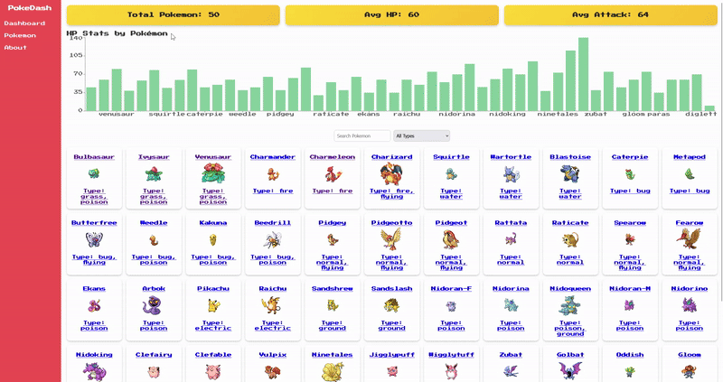

# Web Development Project 6 - PokéDash

Submitted by: **Hai Hoang**

This web app: **displays a Pokémon dashboard that allows users to explore 50 different Pokémon using data fetched from the PokéAPI. Users can search and filter Pokémon, view charts of their stats, and click into each Pokémon to see a detailed page with additional information. The app uses React Router for navigation and Recharts for data visualizations, all wrapped in a retro-themed UI.**

Time spent: **5 hours spent in total**

## Required Features

The following **required** functionality is completed:

- [x] **Clicking on an item in the list view displays more details about it**
  - Clicking on an item in the dashboard list navigates to a detail view for that item
  - Detail view includes extra information about the item not included in the dashboard view (e.g., height, weight, base XP, abilities, full stat list)
  - The same sidebar is displayed in detail view as in dashboard view
  - *Sidebar is visible in the video walkthrough for accurate grading*
- [x] **Each detail view of an item has a direct, unique URL link to that item’s detail view page**
  - *URL/address bar is shown in the walkthrough recording*
- [x] **The app includes at least two unique charts developed using the fetched data that tell an interesting story**
  - Chart 1: Bar chart of HP stats by Pokémon
  - Chart 2: Bar chart of Attack stats by Pokémon
  - Charts appear in the dashboard view

## Optional Features

The following **optional** features are implemented:

- [x] The dashboard is visually customized and styled with a retro Pokémon theme
- [ ] The site allows users to toggle between different data visualizations

## Additional Features

* [x] Hover animations on Pokémon cards
* [x] Responsive grid layout for different screen sizes
* [x] Search and type filter update results live
* [x] Sidebar navigation design carried over from Part 1

## Video Walkthrough

Here's a walkthrough of implemented user stories:

GIF created with ezgif

## Notes

Challenges encountered while building the app:
- Working with nested data from PokéAPI and rendering multiple API calls in parallel using `Promise.all`
- Integrating Recharts and keeping the layout clean and readable
- Ensuring URL routing worked on refresh and directly typing in detail URLs

## License

    Copyright 2025 Hai Hoang

    Licensed under the Apache License, Version 2.0 (the "License");
    you may not use this file except in compliance with the License.
    You may obtain a copy of the License at

        http://www.apache.org/licenses/LICENSE-2.0

    Unless required by applicable law or agreed to in writing, software
    distributed under the License is distributed on an "AS IS" BASIS,
    WITHOUT WARRANTIES OR CONDITIONS OF ANY KIND, either express or implied.
    See the License for the specific language governing permissions and
    limitations under the License.